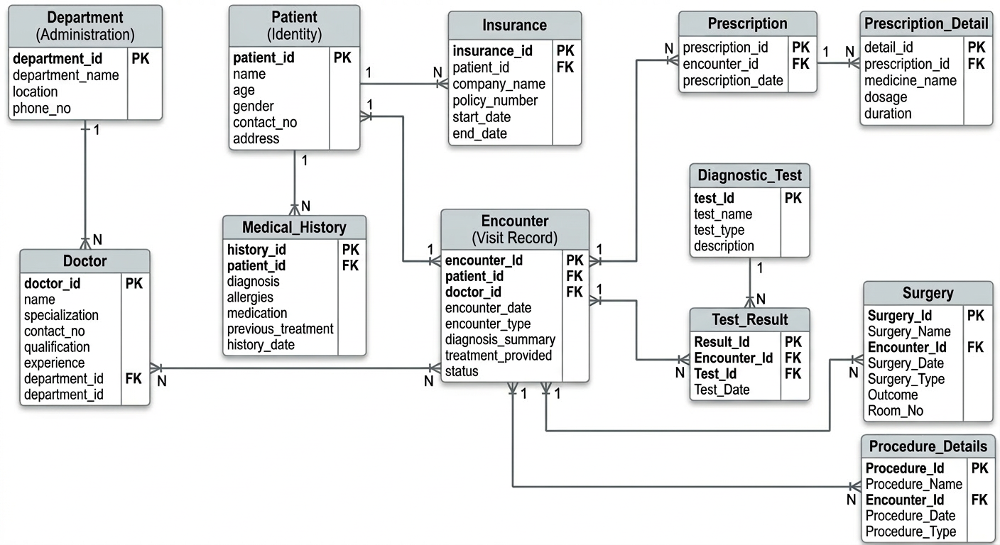

# Hospital Management Database

## Overview

Hospital Management Database is a relational database design project built using **MySQL**.  
The system models core hospital operations including patient records, doctor management, department organization, appointment scheduling, and treatment tracking.

The database is designed using **relational database principles** with properly structured tables, primary keys, and foreign key constraints to maintain data integrity and consistency.

This project demonstrates practical database design concepts such as **entity relationship modeling, normalization, and structured SQL schema implementation**.

---

## Features

- Patient information management
- Doctor information management
- Department management
- Appointment scheduling system
- Treatment and medical record tracking
- Relational data integrity using foreign keys
- Structured database schema using SQL

---

## Technologies

- MySQL
- SQL
- Relational Database Design

---

## Concepts Demonstrated

- Relational schema design
- Entity relationship modeling
- Primary key and foreign key constraints
- Table relationships
- Data normalization
- SQL schema creation

---

## Project Structure

hospital-management-database
│
├── database
│   └── hospital_schema.sql
│
├── er-diagram
│   └── hospital-er-diagram.png
│
├── sample-queries
│   └── queries.sql
│
└── README.md

---

## ER Diagram

The ER diagram illustrates the relationships between the major entities used in the system such as patients, doctors, departments, appointments, and treatments.



---

## Sample Queries

Example SQL queries demonstrating how to retrieve and analyze hospital data are included in:sample-queries/queries.sql

These queries demonstrate operations such as:

- Retrieving patient records
- Viewing doctor details
- Listing appointments
- Joining patient and doctor data
- Aggregating appointment information

---

## How to Run

### 1. Create the database

```sql
CREATE DATABASE Healthcare_Records;

2. Import the schema

Run the schema file to create all tables and relationships.
mysql -u root -p Healthcare_Records < database/hospital_schema.sql

---

Learning Context

This project was created to practice database schema design and relational modeling for backend systems.

The focus was on designing a structured relational database capable of supporting hospital workflows such as patient management and appointment scheduling while maintaining proper entity relationships and normalized tables.

---

Author

Hariprasad Bharkar

Java Backend Developer

GitHub
https://github.com/BharkarHariprasad

LinkedIn
https://www.linkedin.com/in/hariprasad-bharkar
